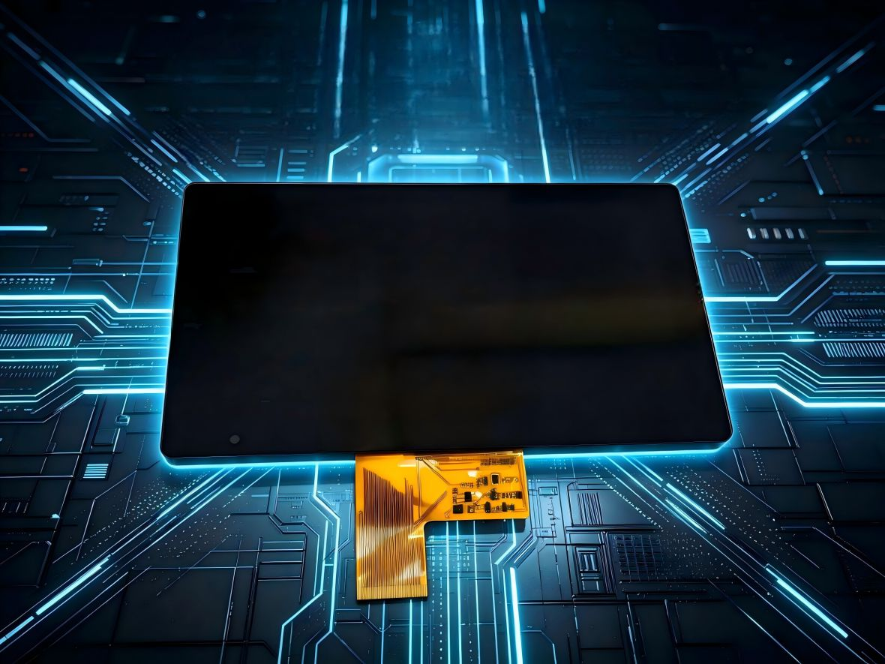

# 7.0-Inch TFT LCD Module for Two-Wheeled Electric Vehicles (ZZW700HIH-2072A)

This 7.0-inch TFT LCD display module (**ZZW700HIH-2072A**) is specifically engineered for two-wheeled electric vehicles, smart dashboards, and automotive display applications. Featuring a high-resolution 1024x600 display and an all-around viewing angle, it delivers superior clarity and reliable performance for outdoor instrumentation.

---

## 🛠️ Technical Specifications

| Parameter | Specification |
| :--- | :--- |
| **Product Model** | ZZW700HIH-2072A (LCM + LENS) |
| **Screen Size** | 7.0 Inch |
| **Resolution** | 1024 × 600 (WSVGA) |
| **Viewing Angle** | All 'O Clock (Full Viewing Angle) |
| **Interface Type** | RGB |
| **Display Mode** | 16.7M Color TFT, Transmissive, Normally White Mode |
| **Category** | Car & Electric Vehicle Display |
| **Target Application** | Two-Wheeled Electric Vehicle Cluster / Smart Dashboard |

---

## 🖼️ Product Images & Dimensions

*(Please upload the product images to your repository's `images/` folder and verify the image links below)*

*Figure 1: Front view of the 7.0-inch EV display module with custom cover lens.*

---

## 📌 Key Features & Engineering Advantages

* **Optimized for Outdoor Environments**: Designed to handle direct sunlight readability and high contrast for outdoor electric vehicle applications.
* **Full Viewing Angle**: Supports All 'O Clock viewing angles, ensuring high legibility for riders at various seating positions.
* **Integrated Customization**: Supports custom cover lens (LCM + LENS assembly) and optical bonding tailored for automotive and motorcycle dashboards.

---

## 📥 Engineering Resources & Downloads

* 📄 **Datasheet (PDF)**: [Download ZZW700HIH-2072A Datasheet](./Datasheets/inquiry-notice.md)
* 📐 **2D/3D CAD Drawing**: [Request CAD Drawing (DXF/STP)](mailto:sales@zoneway.com?subject=CAD%20Request%20-%20ZZW700HIH-2072A)

---

## 💬 Inquiry & Customization

We support deep **OEM/ODM customization** for display interfaces (RGB/MIPI/LVDS), touch panels (CTP), cover lens design, and optical bonding.

* **Sales Inquiry**: [sales@zoneway.com](mailto:sales@zoneway.com?subject=Inquiry%20regarding%20ZZW700HIH-2072A%20Display)
* **Direct Tel**: +86-755-27765458
* **Official Website**: [www.zoneway.com](https://www.zoneway.com)
